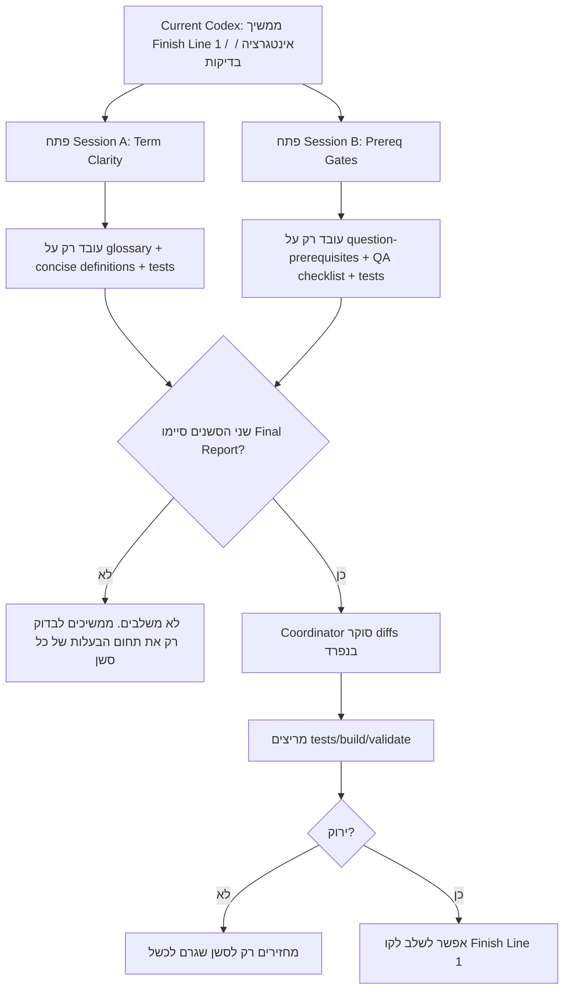
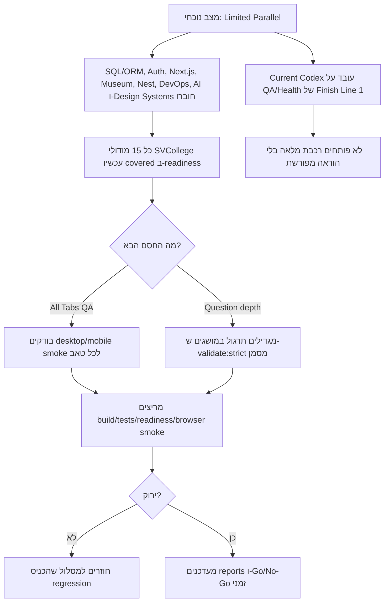
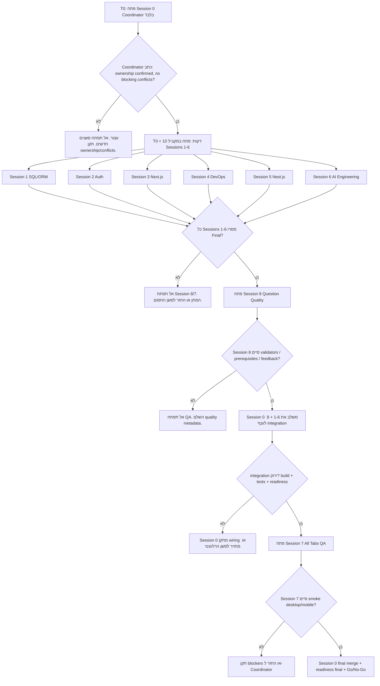

# SVCollege Parallel Session Prompts

> תאריך: 2026-04-28
> יעד: Finish Line 1 — כיסוי מלא של `SVCollege — קורס AI & Full Stack` בכל הפורטל
> שימוש: להעתיק לכל Session את הפרומפט המתאים בדיוק כפי שהוא.

---

## Current Operating Mode — 2 Independent Repair Sessions

> עדכון 2026-04-29: מותר לפתוח רק שני סשני תיקון קלים יחסית, שאינם תלויים זה בזה ואינם נוגעים ב-`app.js`. המטרה היא לסגור בעיות אמיתיות סביב מושגים/הסברים ודרישות קדם לשאלות, בלי לפתוח שוב רכבת מיזוג רחבה.

### תרשים זרימה — מתי כל אחד עובד



### Session A — Term Clarity + Floating Glossary Coverage

| Field | Value |
|---|---|
| Branch | `codex/svcollege-term-clarity` |
| Model | GPT-5.4 / GPT-5.5 |
| Intelligence | Medium-High |
| Difficulty | קל-בינוני |
| Ownership | `data/glossary.js`, `data/concise_definitions.js`, `tests/glossary.test.js`, `tests/concise-definitions.test.js` |
| אסור לערוך | `app.js`, `style.css`, `content-loader.js`, `index.html`, reports מרכזיים |

#### Prompt להעתקה

```text
יעד: Finish Line 1 — תיקון בעיות שפה, מונחים וחלונות הסבר בלי לגעת ב-app.js.

Repo: /Users/tal/Desktop/חומרים לשיעור
AGENTS rule: אסור להשתמש ב-Math.random בשום קוד. אין fake data/placeholders.

אתה לא לבד בקודבייס: יש עבודה מקבילה. אסור להחזיר/לדרוס שינויים של אחרים.

Branch מוצע: codex/svcollege-term-clarity
Model/Intelligence: GPT-5.4 או GPT-5.5, Medium-High.

בעלות קבצים מותרת:
- data/glossary.js
- data/concise_definitions.js
- tests/glossary.test.js
- tests/concise-definitions.test.js
- אופציונלי: docs/session-integration/term-clarity.md

משימה:
1. בדוק מונחי SVCollege שמופיעים בתוך דרישות קדם ושאלות, במיוחד:
   primitive, value, byte, bit, key, variable, array, function, object, class,
   stack, heap, reference, scope, callback, promise, async, await, component,
   prop, state, hook, route, middleware, token, cookie, session, SQL, ORM,
   migration, transaction, SSR, API route, DI, Docker, CI/CD, RAG.
2. ודא שלכל מונח יש entry מלא ב-data/glossary.js עם he/short/long/category.
3. short חייב להיות משפט אחד קצר ותכלסי: "מה זה", בלי מילים מיותרות.
4. הרחב data/concise_definitions.js רק למושגים שבהם ההסבר עדיין לא אומר בשורה אחת מה זה.
5. עדכן בדיקות שמוודאות שמונחי חובה קיימים וש-short לא ריק ולא ארוך מדי.

כללים:
- אסור Math.random.
- אסור fake data או placeholders.
- אל תייבא ספריות.
- אל תשנה UI או wiring.
- אם מונח לא ברור כחלק מהקורס, כתוב unknown/unavailable במסמך אינטגרציה במקום להמציא.

חובה להריץ:
- node --check data/glossary.js
- node --check data/concise_definitions.js
- npm test -- --run tests/glossary.test.js tests/concise-definitions.test.js tests/no-native-random.test.js
- npm run build

בסיום דווח:
- קבצים ששונו
- כמה מונחים נוספו/תוקנו
- 5 דוגמאות ל-short definitions הכי חשובים
- בדיקות שעברו
- מה נשאר חסום, אם יש
```

### Session B — Question Prerequisite Gates + QA Checklist

| Field | Value |
|---|---|
| Branch | `codex/svcollege-prereq-gates` |
| Model | GPT-5.4 |
| Intelligence | High |
| Difficulty | בינוני |
| Ownership | `src/core/question-prerequisites.js`, `tests/question-prerequisites.test.js`, `scripts/build_question_qa_checklist.js`, `QUESTION_QA_CHECKLIST.md`, `QUESTION_QA_CHECKLIST.json` |
| אסור לערוך | `app.js`, `style.css`, `content-loader.js`, `index.html`, `data/glossary.js`, `data/concise_definitions.js` |

#### Prompt להעתקה

```text
יעד: Finish Line 1 — QA קל/בינוני לדרישות קדם ושערי מוכנות, בלי לגעת ב-app.js.

Repo: /Users/tal/Desktop/חומרים לשיעור
AGENTS rule: אסור להשתמש ב-Math.random בשום קוד. אין fake data/placeholders.

אתה לא לבד בקודבייס: יש עבודה מקבילה. אסור להחזיר/לדרוס שינויים של אחרים.

Branch מוצע: codex/svcollege-prereq-gates
Model/Intelligence: GPT-5.4, High.

בעלות קבצים מותרת:
- src/core/question-prerequisites.js
- tests/question-prerequisites.test.js
- scripts/build_question_qa_checklist.js
- QUESTION_QA_CHECKLIST.md
- QUESTION_QA_CHECKLIST.json
- אופציונלי: docs/session-integration/prereq-gates.md

משימה:
1. בדוק את מנגנון דרישות הקדם לשאלות: כל שאלה קשה או מושג מורכב צריכים להחזיר required concepts + required terms + side explanation source.
2. הוסף quality gate דטרמיניסטי שמאתר שאלות SVCollege ללא דרישות קדם ברורות.
3. אם כבר קיים checklist, הרחב אותו במקום ליצור מערכת חדשה.
4. התמקד בדברים קלים יחסית: בדיקות, דוח, contract ברור. אל תבנה UI חדש.
5. ודא שהדוח מבליט בעיות אמיתיות:
   missingPrerequisites, missingGlossaryTerms, hardQuestionWithoutAid, repeatedLowSignalExplanation.
6. אם יש פערים שלא ניתן לתקן בלי עריכת בנק שאלות ענק, תעד אותם ב-QUESTION_QA_CHECKLIST.md כמשימות סגירה, לא כפתרון מזויף.

כללים:
- אסור Math.random.
- אסור fake data או invented sources.
- אל תייבא ספריות.
- אל תשנה UI/wiring.
- אל תדרוס reports שלא יצרת אם הם השתנו; עבוד עם השינויים הקיימים.

חובה להריץ:
- node --check src/core/question-prerequisites.js
- node --check scripts/build_question_qa_checklist.js
- npm test -- --run tests/question-prerequisites.test.js tests/question-qa-checklist.test.js tests/no-native-random.test.js
- npm run build

בסיום דווח:
- קבצים ששונו
- אילו gates נוספו
- מספר בעיות שנמצאו בדוח, אם יש
- בדיקות שעברו
- מה נשאר חסום, אם יש
```

### כלל שילוב

- לא משלבים אף אחד מהסשנים לפני ששניהם מסרו Final Report.
- אם רק אחד סיים, מותר לסקור אותו, אבל לא למזג בלי בדיקות מול הענף הנוכחי.
- אם יש conflict בקובץ שאינו בבעלות הסשן, לא מתקנים שם בתוך הסשן. מחזירים ל-Coordinator.

## Current Operating Mode — Limited Parallel

> סטטוס עדכני: **מוותרים כרגע על רכבת המיזוג המלאה**. SQL/ORM, Auth/Security, Next.js, המוזיאון, Nest.js, DevOps, AI Engineering ו-Design Systems מוזגו/חוברו ל-Finish Line 1. שאר הסשנים במסמך נשארים כתוכנית ייחוס בלבד, ולא פותחים אותם בלי הוראה חדשה.

### מי עובד עכשיו

| Active work | Branch | Ownership | אסור לסשנים אחרים לערוך |
|---|---|---|---|
| Current Codex session | `codex/unified-context-tree-tabs-20260428` | Finish Line 1 browser smoke, question-depth hardening, prerequisite/question feedback, reports, readiness gates, quality gates and validators | Do not reopen the full merge train without explicit user instruction |

### Completed work in limited mode

| Completed work | Branch | Result | Follow-up |
|---|---|---|---|
| SQL/ORM | `codex/svcollege-sql-orm` | Integrated into index, content loader, service worker, readiness, command center and SVCollege blueprint | Only regression fixes; no new SQL scope without a new task |
| Auth/Security | current | Integrated into index, content loader, service worker, readiness, command center and SVCollege blueprint | Only regression fixes; no new Auth scope without a new task |
| Next.js | current | Integrated into index, content loader, service worker, readiness, command center and SVCollege blueprint | Only regression fixes; no new Next.js scope without a new task |
| Museum | `codex/finish-line1-museum-integration-20260428` | Integrated without tracking MP4 assets | Only contextual video embedding; no MP4 upload |
| Nest.js | `codex/svcollege-backend-prod-coverage-20260428` | Integrated into index, content loader, service worker, readiness, command center and SVCollege blueprint | Only regression fixes; no new Nest scope without a new task |
| DevOps | `codex/svcollege-backend-prod-coverage-20260428` | Integrated into index, content loader, service worker, readiness, command center and SVCollege blueprint | Only regression fixes; no new DevOps scope without a new task |
| AI Engineering | `codex/unified-context-tree-tabs-20260428` | Integrated into index, content loader, service worker, readiness, command center and SVCollege blueprint | Only regression fixes; no new AI Engineering scope without a new task |
| Design Systems | `codex/unified-context-tree-tabs-20260428` | Integrated into index, content loader, service worker, readiness, command center and SVCollege blueprint | Only regression fixes; no new design-system scope without a new task |
| Module × Tab Matrix | `codex/unified-context-tree-tabs-20260428` | `225/225` strict cells, `0` tab gaps, `7/7` support tabs wired | Keep `npm run svcollege:tab-matrix:strict` green |

### תרשים זרימה פעיל — Limited Parallel

> זה התרשים המחייב כרגע. כל רכבת הסשנים הרחבה נשארת מוקפאת עד שהמשתמש מחזיר אותה במפורש.



### מתי לפתוח Session חדש במצב הנוכחי

- לא פותחים Session חדש ל-Auth, Next.js, DevOps, Nest.js, AI Engineering, Design Systems, Question Quality או All Tabs QA בלי הוראה מפורשת.
- מותר לפתוח Session המשך ל-SQL רק אם הוא נשאר בתוך קבצי SQL-owned.
- מותר לפתוח Session המשך למוזיאון רק להטמעה הקשרית של סרטון/נכס רלוונטי, בלי העלאת MP4.
- מותר לפתוח Coordinator Integration רק אחרי שמודול יחיד סיים Final Report או שהמשתמש מבטל אותו.
- אם צריך תיקון בקובץ משותף כמו `app.js`, `index.html`, `content-loader.js`, `service-worker.js` או `data/course_blueprints.js`, זה עובר רק דרך Coordinator Integration.

### Opening rule during limited mode

- Do **not** open Sessions 2-8 from the full train.
- Do **not** merge branches automatically.
- Museum is integrated; do not upload MP4 assets.
- This session may continue only on Finish Line 1 health work: all-tabs QA, question-depth hardening, prerequisite/question feedback, command center, reports, readiness scripts, quality gates, task planning, and SVCollege content.
- When any new module finishes, Coordinator reviews only the changed ownership scope for that module.

---

## 0. תרשים זרימה — מתי כל Session עובד

> הערה: התרשים הבא הוא **רכבת המיזוג המלאה המקורית**. במצב הנוכחי הוא מוקפא ומשמש רק כ-reference עד שהמשתמש מחזיר את רכבת הסשנים המלאה.



### כללי פתיחת Session חדש

- פותחים **Session 0** ראשון ורק אותו.
- פותחים **Sessions 1-6** רק אחרי ש-Session 0 כתב במפורש: `Coordinator ready`.
- פותחים **Session 8** רק אחרי שכל Sessions 1-6 מסרו Final Report.
- פותחים **Session 7** רק אחרי ש-Session 0 שילב את 1-6 ואת 8, והענף המשולב עובר build/tests/readiness.
- לא פותחים Session חדש כדי "לעזור" לסשן תקוע בלי להגדיר בעלות קבצים חדשה. אם סשן חסום, חוזרים ל-Session 0.

### תמונת זמן קצרה

| זמן | מי עובד | מותר לפתוח Session חדש? | תנאי מעבר |
|---|---|---|---|
| T0 | Session 0 בלבד | לא | `Coordinator ready` |
| T0+10 | Sessions 1-6 במקביל | לא | Final Report מכל 1-6 |
| אחרי 1-6 | Session 8 | לא | validators/prerequisites/feedback מוכנים |
| אחרי 8 | Session 0 integration | לא | build/tests/readiness ירוקים |
| אחרי integration | Session 7 QA | לא | smoke desktop/mobile הסתיים |
| סוף | Session 0 final | לא | Go/No-Go לקו סיום ראשון |

---

## 1. כללי על שלא משתנים

כל Session חייב לעבוד לפי הכללים האלה:

- היעד היחיד כרגע: SVCollege AI & Full Stack. לא John Bryce, לא Sela, לא generic bootcamp.
- אין שימוש ב-`Math.random()` בשום קוד.
- אין נתונים מומצאים. אם מקור חסר, מסמנים `unknown/unavailable` או מוסיפים TODO ברור.
- לא עורכים קבצים שבבעלות Session אחר.
- לא עורכים `EXECUTION_TASKS.md`, `SPEC_AND_MASTER_PLAN.md`, `SVCOLLEGE_COVERAGE_REPORT.md` או readiness reports, חוץ מ-Session 0 Coordinator.
- לא עורכים מוזיאון, אלא אם זו בדיקת QA כללית שמוכיחה שלא נשבר.
- לא עושים refactor רחב ב-`app.js`; אם צריך wiring משותף, משאירים ל-Coordinator.
- כל Session חייב לסיים עם קבצים ששונו, בדיקות שהורצו, ומה נשאר חסום.

---

## 2. מתי בדיוק לתת כל משימה

### T0 — לפתוח רק את Session 0

תן קודם את משימת **Session 0 Coordinator**.

מטרה: לפתוח branch תיאום, לבדוק מצב repo, לוודא שהקבצים בשורש לא מפריעים, ולהכין נקודת בקרה למיזוג.

לא מחכים שהוא יסיים את כל העבודה. מחכים רק לדיווח קצר:

```text
Coordinator ready: ownership confirmed, no blocking conflicts.
```

### T0 + 10 דקות — לפתוח במקביל את Sessions 1-6

אחרי שה-Coordinator אישר שאין חסם בעלות, נותנים במקביל:

1. Session 1 SQL/ORM
2. Session 2 Auth
3. Session 3 Next.js
4. Session 4 DevOps
5. Session 5 Nest.js
6. Session 6 AI Engineering

הם עובדים בעיקר על קבצי data/tests נפרדים כדי למנוע conflicts.

### אחרי שכל Sessions 1-6 מסרו Final

רק אחרי שכל ששת סשני התוכן סיימו, תן את **Session 8 Question Quality**.

סיבה: הוא צריך לראות את כל השאלות החדשות כדי להוסיף prerequisite contracts, distractor feedback ו-quality gates בצורה אחידה.

### אחרי Session 0 שילב את Sessions 1-6 ו-8 לענף אינטגרציה ירוק

רק אז תן את **Session 7 All Tabs QA**.

סיבה: QA על כל הטאבים חייב לרוץ אחרי שהחומר החדש כבר מחובר לפורטל, אחרת הוא יבדוק תמונה חלקית.

### בסוף — להחזיר ל-Session 0

אחרי Session 7:

1. Session 0 ממזג תיקוני QA.
2. מריץ readiness/build/test.
3. מעדכן דוחות ותוכנית.
4. נותן החלטת Go/No-Go לקו הסיום הראשון.

---

## 3. סדר מיזוג מומלץ

1. `codex/svcollege-sql-orm`
2. `codex/svcollege-auth`
3. `codex/svcollege-nextjs`
4. `codex/svcollege-devops`
5. `codex/svcollege-nestjs`
6. `codex/svcollege-ai-engineering`
7. `codex/svcollege-question-quality`
8. `codex/svcollege-tab-health`
9. `codex/svcollege-coordination`

אם יש conflict בקובץ משותף, ה-Coordinator מחליט. סשני התוכן לא פותרים conflicts של אחרים.

---

## 4. מטריצת בעלות

| Session | Branch | Model | Intelligence | מתי לפתוח | בעלות ראשית |
|---|---|---:|---:|---|---|
| 0 Coordinator | `codex/svcollege-coordination` | GPT-5.5 | xhigh | T0 | תוכניות, דוחות, מיזוג, wiring משותף |
| 1 SQL/ORM | `codex/svcollege-sql-orm` | GPT-5.5 | high | T0+10 | SQL/PostgreSQL/Prisma/Drizzle content |
| 2 Auth | `codex/svcollege-auth` | GPT-5.5 | xhigh | T0+10 | Auth/security content |
| 3 Next.js | `codex/svcollege-nextjs` | GPT-5.5 | high | T0+10 | Next.js content |
| 4 DevOps | `codex/svcollege-devops` | GPT-5.4 | high | T0+10 | DevOps/Docker/CI content |
| 5 Nest.js | `codex/svcollege-nestjs` | GPT-5.5 | high | T0+10 | Nest.js content |
| 6 AI Engineering | `codex/svcollege-ai-engineering` | GPT-5.5 | xhigh | T0+10 | AI SDK/RAG/Agents content |
| 8 Question Quality | `codex/svcollege-question-quality` | GPT-5.4 | high | אחרי 1-6 | validators, prerequisites, feedback |
| 7 All Tabs QA | `codex/svcollege-tab-health` | GPT-5.4 | high | אחרי integration | smoke/e2e/tests + small fixes |

---

## 5. Session 0 — Coordinator

### לתת מתי

ראשון. לפני כל Session אחר.

### Prompt להדבקה

```text
אתה Session 0 Coordinator עבור LumenPortal.

Branch חובה:
codex/svcollege-coordination

Model:
GPT-5.5

Intelligence:
xhigh / Very High

היעד:
Finish Line 1 — כיסוי מלא של SVCollege AI & Full Stack בלבד בכל הפורטל.

תפקידך:
לתאם את כל סשני העבודה המקבילים, למנוע conflicts, לבצע wiring משותף, למזג לפי סדר, להריץ readiness, ולעדכן דוחות ותוכנית.

כללי ברזל:
- אין Math.random בשום קוד.
- לא ממציאים נתונים.
- לא מוסיפים קורסים שאינם SVCollege לפורטל הזה.
- אל תבצע תוכן עומק של SQL/Auth/Next/DevOps/Nest/AI בעצמך אם Session ייעודי מטפל בזה.
- אל תמחק עבודה של אחרים.

בעלות קבצים שלך:
- EXECUTION_TASKS.md
- SPEC_AND_MASTER_PLAN.md
- SVCOLLEGE_COVERAGE_REPORT.md
- SVCOLLEGE_READINESS_REPORT.md
- SVCOLLEGE_READINESS_REPORT.json
- SVCOLLEGE_LESSON_INVENTORY.md
- data/course_blueprints.js
- data/lesson_quiz_keys.js
- data/prerequisites.js
- content-loader.js
- index.html
- service-worker.js
- scripts/report_svcollege_readiness.js
- tests/svcollege-readiness*.test.js
- tests/course-blueprints.test.js
- integration notes under docs/ or reports

אסור לך לערוך:
- קבצי lesson ייעודיים של Sessions 1-6 בזמן שהם עובדים, אלא אחרי שהם מסרו Final.
- museum.html או קוד מוזיאון, אלא אם QA מוכיח שבירה.

משימות:
1. פתח branch coordination.
2. בדוק git status וקרא את EXECUTION_TASKS.md, SVCOLLEGE_COVERAGE_REPORT.md, SVCOLLEGE_LESSON_INVENTORY.md.
3. ודא שהיעד הפעיל הוא רק svcollege_fullstack_ai.
4. אשר שאין חסם לפתיחת Sessions 1-6.
5. אל תחכה לסשנים. דווח: "Coordinator ready".
6. כאשר Sessions 1-6 מסיימים, שלב אותם לפי הסדר:
   - SQL/ORM
   - Auth
   - Next.js
   - DevOps
   - Nest.js
   - AI Engineering
7. לאחר כל שילוב:
   - חבר lesson חדש ל-content-loader/index/service-worker.
   - חבר quiz keys/prerequisites/readiness/course_blueprints.
   - ודא שכל lesson מופיע בעץ הצד ובמבחן SVCollege.
8. אחרי שילוב Session 8:
   - ודא שלכל שאלה קשה יש questionPrerequisites או metadata שקול.
   - ודא ש-quality scripts עוברים.
9. אחרי Session 7:
   - שלב תיקוני smoke.
   - עדכן readiness reports.
   - עדכן EXECUTION_TASKS.md.

בדיקות חובה לפני Final:
node --check app.js
node --check content-loader.js
node --check data/course_blueprints.js
npm run svcollege:readiness:write
npm run coverage:features:strict
npm test -- --run
npm run build

Final report:
- אילו branches שולבו.
- readiness לפני/אחרי.
- כמה מודולי SVCollege covered/partial/gap.
- אילו release blockers נשארו.
- אילו בדיקות הורצו.
```

### DoD

- כל branches שולבו בלי דריסת עבודה.
- `COURSE_BLUEPRINTS` עדיין כולל רק `svcollege_fullstack_ai`.
- readiness report מעודכן.
- build/test ירוקים.

---

## 6. Session 1 — SQL/ORM

### לתת מתי

T0 + 10 דקות, במקביל ל-Sessions 2-6.

### Prompt להדבקה

```text
אתה Session 1 SQL/ORM עבור LumenPortal.

Branch חובה:
codex/svcollege-sql-orm

Model:
GPT-5.5

Intelligence:
high

היעד:
לסגור את פער SVCollege במודול SQL/PostgreSQL/ORM: schema, relations, migrations, Prisma/Drizzle CRUD.

כללי ברזל:
- אין Math.random בשום קוד.
- אל תיגע ב-EXECUTION_TASKS.md או דוחות readiness.
- אל תערוך app.js, index.html, content-loader.js, service-worker.js או data/course_blueprints.js. ה-Coordinator יחבר.
- אל תערוך קבצי lesson של Sessions אחרים.
- אל תמציא APIs. אם פרט לא ודאי, כתוב unknown/unavailable או השאר הערה.

בעלות קבצים:
- data/lesson_sql_orm.js
- data/svcollege_questions_sql_orm.js
- data/svcollege_traces_sql_orm.js
- data/svcollege_builds_sql_orm.js
- data/svcollege_prerequisites_sql_orm.js
- tests/svcollege-sql-orm-content.test.js
- docs/session-integration/sql-orm.md

משימות תוכן:
1. צור lesson מלא `LESSON_SQL_ORM`.
2. כלול לפחות 14 מושגים:
   - SQL
   - PostgreSQL
   - database
   - table
   - row
   - column
   - primary key
   - foreign key
   - relation
   - JOIN
   - schema
   - migration
   - ORM
   - Prisma
   - Drizzle
   - CRUD
   - transaction
3. לכל מושג:
   - הסבר פשוט בעברית.
   - למה זה חשוב ב-Full Stack.
   - דוגמת קוד או SQL קצרה.
   - טעות נפוצה.
   - דרישת קדם.
4. צור שאלות:
   - לפחות 18 MC.
   - לפחות 10 Fill.
   - לפחות 3 Code Trace.
   - לפחות 3 Mini Build.
   - לפחות 2 Bug Hunt אם מתאים.
5. כל שאלה קשה חייבת לכלול metadata של דרישות קדם:
   - requiredConcepts
   - requiredTerms
   - sideExplanation
6. צור integration note ל-Coordinator:
   - איזה globals נוצרים.
   - איזה lessonId.
   - איזה module ב-SVCollege blueprint צריך לעבור ל-covered.
   - אילו script tags צריך להוסיף.
   - אילו tests צריך להריץ.

דרישות איכות:
- לא ללמד Prisma/Drizzle כאילו הם חובה תמיד. להסביר שהם כלים מעל SQL.
- להסביר למה MongoDB שכבר קיים בפורטל לא מכסה את כל דרישת SVCollege ל-SQL.
- לכל דוגמה לציין יעילות/סיכון: raw SQL מול ORM.

בדיקות חובה:
node --check data/lesson_sql_orm.js
node --check data/svcollege_questions_sql_orm.js
node --check data/svcollege_traces_sql_orm.js
node --check data/svcollege_builds_sql_orm.js
node --check data/svcollege_prerequisites_sql_orm.js
npm test -- --run tests/svcollege-sql-orm-content.test.js
npm run build

Final report:
- קבצים ששונו.
- רשימת מושגים.
- כמות MC/Fill/Trace/Build/Bug.
- מה ה-Coordinator צריך לחבר.
- בדיקות שהורצו ותוצאה.
```

### DoD

- קבצי data עצמאיים תקינים.
- אין עריכה בקבצים משותפים.
- test ייעודי עובר.
- integration note ברור.

---

## 7. Session 1B — SQL/ORM Hardening

### לתת מתי

רק אחרי ש-Session 1 SQL/ORM מסר Final Report, ורק אם הבדיקה מצאה בעיית איכות בתוך קבצי SQL-owned. לא לפתוח את זה במקביל ל-Session 1.

### Prompt להדבקה

```text
אתה Session 1B SQL/ORM Hardening עבור LumenPortal.

Branch חובה:
codex/svcollege-sql-orm

Model:
GPT-5.5

Intelligence:
high

היעד:
להקשיח את מודול SQL/ORM לפני שה-Coordinator מחבר אותו לפורטל.

בעלות קבצים:
מותר לערוך רק:
- data/svcollege_builds_sql_orm.js
- tests/svcollege-sql-orm-content.test.js
- docs/session-integration/sql-orm.md

אסור לערוך:
- app.js
- content-loader.js
- index.html
- service-worker.js
- data/course_blueprints.js
- data/lesson_quiz_keys.js
- scripts/report_svcollege_readiness.js
- EXECUTION_TASKS.md
- קבצי מוזיאון

משימות:
1. תקן את Mini Build `build_svsql_002`:
   - הרפרנס משתמש נכון ב-Prisma shorthand: `where: { id }`.
   - אל תדרוש regex של `id:` בלבד.
   - ודא שהטסטים לא מכריחים כתיבה לא טבעית כמו `id: id`.
2. הוסף ל-`tests/svcollege-sql-orm-content.test.js` בדיקה שכל Mini Build `reference` עובר את כל ה-regex tests שלו.
3. בדוק שכל MC/Fill/Trace/Bug/Build כוללים:
   - `conceptKey`
   - `requiredConcepts`
   - `requiredTerms`
   - `sideExplanation`
4. עדכן את `docs/session-integration/sql-orm.md` עם checklist מדויק ל-Coordinator:
   - script tags בסדר נכון.
   - wiring ל-loader/tree.
   - wiring ל-readiness.
   - blueprint status מ-partial ל-covered רק אחרי שהטאב מציג בפועל.
   - בדיקות שצריך להריץ אחרי integration.

חובה להריץ:
node --check data/svcollege_builds_sql_orm.js
node --check tests/svcollege-sql-orm-content.test.js
npm test -- --run tests/svcollege-sql-orm-content.test.js tests/no-native-random.test.js
npm run build

כללים:
- אין Math.random.
- אין fake/demo/sample/placeholder data.
- אל תיגע במוזיאון.
- אל תחבר בעצמך ל-app.js או index.html.

Final report:
- קבצים ששונו.
- בדיקות שעברו.
- מה נשאר ל-Coordinator.
```

### DoD

- `build_svsql_002` לא פוסל פתרון Prisma תקין עם `where: { id }`.
- כל reference של Mini Build עובר את ה-tests של עצמו.
- integration checklist מספיק מפורט לחיבור ללא שאלות.

---

## 8. Session 2 — Auth

### לתת מתי

T0 + 10 דקות, במקביל ל-Sessions 1,3,4,5,6.

### Prompt להדבקה

```text
אתה Session 2 Auth עבור LumenPortal.

Branch חובה:
codex/svcollege-auth

Model:
GPT-5.5

Intelligence:
xhigh / Very High

היעד:
לסגור את פער SVCollege באימות ואבטחה: JWT, cookies, sessions, OAuth/provider auth, Supabase/Appwrite/Firebase/Kinde ברמת מושגים, ו-security boundaries.

כללי ברזל:
- אין Math.random בשום קוד.
- אין API keys, tokens או secrets בקוד.
- לא ממציאים endpoints.
- לא נותנים דוגמה לא בטוחה בלי לסמן אותה כטעות.
- אל תערוך app.js/index/content-loader/service-worker/course_blueprints. ה-Coordinator יחבר.

בעלות קבצים:
- data/lesson_auth_security.js
- data/svcollege_questions_auth.js
- data/svcollege_traces_auth.js
- data/svcollege_builds_auth.js
- data/svcollege_prerequisites_auth.js
- tests/svcollege-auth-content.test.js
- docs/session-integration/auth.md

משימות תוכן:
1. צור lesson מלא `LESSON_AUTH_SECURITY`.
2. כלול לפחות 16 מושגים:
   - authentication
   - authorization
   - session
   - cookie
   - secure cookie
   - JWT
   - access token
   - refresh token
   - OAuth
   - provider auth
   - password hashing
   - bcrypt concept
   - CSRF
   - XSS boundary
   - CORS
   - middleware guard
   - Supabase Auth
   - Firebase/Auth provider
   - Kinde/Appwrite as provider examples
3. לכל מושג:
   - הסבר פשוט.
   - מה הבעיה שהוא פותר.
   - מה לא לעשות.
   - דוגמת קוד בטוחה או pseudo-code.
   - דרישות קדם.
4. צור שאלות:
   - לפחות 20 MC.
   - לפחות 10 Fill.
   - לפחות 3 Trace.
   - לפחות 3 Mini Build.
   - לפחות 3 Bug Hunt.
5. כל שאלה קשה חייבת metadata:
   - requiredConcepts
   - requiredTerms
   - sideExplanation
6. צור integration note ל-Coordinator.

דרישות איכות:
- להבדיל בבירור בין authentication לבין authorization.
- להסביר למה localStorage לטוקנים רגישים מסוכן.
- לא להציג password plaintext כדוגמה תקינה.
- לא לבנות provider אמיתי עם key. רק מבנה רעיוני ו-flow.

בדיקות חובה:
node --check data/lesson_auth_security.js
node --check data/svcollege_questions_auth.js
node --check data/svcollege_traces_auth.js
node --check data/svcollege_builds_auth.js
node --check data/svcollege_prerequisites_auth.js
npm test -- --run tests/svcollege-auth-content.test.js
npm run build

Final report:
- קבצים ששונו.
- אילו מושגי אבטחה מכוסים.
- אילו דוגמאות סומנו כלא בטוחות.
- מה ה-Coordinator צריך לחבר.
- בדיקות ותוצאה.
```

### DoD

- אין secrets.
- כל דוגמת אבטחה מסומנת כבטוחה או anti-pattern.
- test ייעודי עובר.

---

## 9. Session 3 — Next.js

### לתת מתי

T0 + 10 דקות, במקביל ל-Sessions 1,2,4,5,6.

### Prompt להדבקה

```text
אתה Session 3 Next.js עבור LumenPortal.

Branch חובה:
codex/svcollege-nextjs

Model:
GPT-5.5

Intelligence:
high

היעד:
לסגור את פער SVCollege ב-Next.js: routing, layouts, server/client components, route handlers/API routes, SSR/SSG, SEO, deploy.

כללי ברזל:
- אין Math.random בשום קוד.
- אל תכתוב ש-Next.js מחליף את React. הוא framework מעל React.
- אם יש פרט API עדכני שאתה לא בטוח בו, בדוק מקורות רשמיים או סמן unknown/unavailable.
- אל תערוך app.js/index/content-loader/service-worker/course_blueprints.

בעלות קבצים:
- data/lesson_nextjs.js
- data/svcollege_questions_nextjs.js
- data/svcollege_traces_nextjs.js
- data/svcollege_builds_nextjs.js
- data/svcollege_prerequisites_nextjs.js
- tests/svcollege-nextjs-content.test.js
- docs/session-integration/nextjs.md

משימות תוכן:
1. צור lesson מלא `LESSON_NEXTJS`.
2. כלול לפחות 15 מושגים:
   - Next.js
   - App Router
   - route
   - layout
   - page
   - dynamic route
   - server component
   - client component
   - route handler
   - API route
   - SSR
   - SSG
   - metadata
   - SEO
   - loading UI
   - error boundary
   - deploy to Vercel
3. לכל מושג:
   - הסבר פשוט בעברית.
   - מה React לבד לא נותן כאן.
   - דוגמת קוד קצרה.
   - מתי זה יעיל ומתי לא.
   - דרישות קדם.
4. צור שאלות:
   - לפחות 18 MC.
   - לפחות 10 Fill.
   - לפחות 3 Trace.
   - לפחות 3 Mini Build.
   - לפחות 2 Bug Hunt.
5. כל שאלה קשה כוללת:
   - requiredConcepts
   - requiredTerms
   - sideExplanation
6. צור integration note ל-Coordinator.

דרישות איכות:
- להפריד בין Server Component לבין Client Component.
- להסביר למה `use client` לא שמים בכל מקום.
- להסביר SEO דרך metadata ולא רק "כותרת בדפדפן".
- להראות Route Handler קטן בלי API keys.

בדיקות חובה:
node --check data/lesson_nextjs.js
node --check data/svcollege_questions_nextjs.js
node --check data/svcollege_traces_nextjs.js
node --check data/svcollege_builds_nextjs.js
node --check data/svcollege_prerequisites_nextjs.js
npm test -- --run tests/svcollege-nextjs-content.test.js
npm run build

Final report:
- קבצים ששונו.
- רשימת מושגים.
- כיסוי שאלות ו-builds.
- מה ה-Coordinator צריך לחבר.
- בדיקות ותוצאה.
```

### DoD

- Next.js מוסבר כ-full-stack framework מעל React.
- יש mini-build אחד לפחות ל-route + server/client distinction.
- test ייעודי עובר.

---

## 10. Session 4 — DevOps

### לתת מתי

T0 + 10 דקות, במקביל ל-Sessions 1,2,3,5,6.

### Prompt להדבקה

```text
אתה Session 4 DevOps עבור LumenPortal.

Branch חובה:
codex/svcollege-devops

Model:
GPT-5.4

Intelligence:
high

היעד:
לסגור את פער SVCollege ב-DevOps: Vercel, Docker, Docker Compose, CI/CD, env vars, testing workflow, release checklist.

כללי ברזל:
- אין Math.random בשום קוד.
- אל תערוך CI אמיתי או .github workflows אלא אם Coordinator ביקש.
- אל תוסיף secrets או env אמיתיים.
- אל תערוך app.js/index/content-loader/service-worker/course_blueprints.

בעלות קבצים:
- data/lesson_devops_deploy.js
- data/svcollege_questions_devops.js
- data/svcollege_traces_devops.js
- data/svcollege_builds_devops.js
- data/svcollege_prerequisites_devops.js
- tests/svcollege-devops-content.test.js
- docs/session-integration/devops.md

משימות תוכן:
1. צור lesson מלא `LESSON_DEVOPS_DEPLOY`.
2. כלול לפחות 14 מושגים:
   - deployment
   - Vercel
   - environment variables
   - build
   - preview deployment
   - production deployment
   - CI
   - CD
   - GitHub Actions concept
   - Docker
   - Dockerfile
   - Docker Compose
   - container
   - image
   - health check
   - rollback
   - smoke test
3. לכל מושג:
   - הסבר פשוט.
   - למה זה חשוב ל-Full Stack.
   - דוגמת config קצרה או pseudo-code.
   - טעות נפוצה.
   - דרישות קדם.
4. צור שאלות:
   - לפחות 16 MC.
   - לפחות 8 Fill.
   - לפחות 2 Trace/config trace.
   - לפחות 3 Mini Build/config build.
   - לפחות 2 Bug Hunt.
5. כל שאלה קשה כוללת prerequisite metadata.
6. צור integration note ל-Coordinator.

דרישות איכות:
- להבדיל בין build לבין deploy.
- להבדיל בין image לבין container.
- להסביר למה env vars לא שומרים בקוד.
- להראות Dockerfile פשוט, לא production fantasy.

בדיקות חובה:
node --check data/lesson_devops_deploy.js
node --check data/svcollege_questions_devops.js
node --check data/svcollege_traces_devops.js
node --check data/svcollege_builds_devops.js
node --check data/svcollege_prerequisites_devops.js
npm test -- --run tests/svcollege-devops-content.test.js
npm run build

Final report:
- קבצים ששונו.
- כיסוי מושגים.
- דוגמאות config שנוספו.
- מה ה-Coordinator צריך לחבר.
- בדיקות ותוצאה.
```

### DoD

- אין secrets.
- יש mini-build ל-Dockerfile או deploy checklist.
- test ייעודי עובר.

---

## 11. Session 5 — Nest.js

### לתת מתי

T0 + 10 דקות, במקביל ל-Sessions 1,2,3,4,6.

### Prompt להדבקה

```text
אתה Session 5 Nest.js עבור LumenPortal.

Branch חובה:
codex/svcollege-nestjs

Model:
GPT-5.5

Intelligence:
high

היעד:
לסגור את פער SVCollege ב-Nest.js: modules, controllers, providers, dependency injection, DTO, pipes, guards, service architecture.

כללי ברזל:
- אין Math.random בשום קוד.
- אל תציג Nest.js כתחליף ל-Node.js. הוא framework מעל Node.js.
- אל תערוך app.js/index/content-loader/service-worker/course_blueprints.

בעלות קבצים:
- data/lesson_nestjs.js
- data/svcollege_questions_nestjs.js
- data/svcollege_traces_nestjs.js
- data/svcollege_builds_nestjs.js
- data/svcollege_prerequisites_nestjs.js
- tests/svcollege-nestjs-content.test.js
- docs/session-integration/nestjs.md

משימות תוכן:
1. צור lesson מלא `LESSON_NESTJS`.
2. כלול לפחות 14 מושגים:
   - Nest.js
   - module
   - controller
   - provider
   - service
   - dependency injection
   - decorator
   - DTO
   - pipe
   - validation pipe
   - guard
   - middleware
   - exception filter
   - repository pattern
   - Express adapter concept
3. לכל מושג:
   - הסבר פשוט.
   - איך הוא מחליף/מסדר Express ידני.
   - דוגמת קוד קצרה.
   - מתי זה יעיל ומתי overkill.
   - דרישות קדם.
4. צור שאלות:
   - לפחות 16 MC.
   - לפחות 8 Fill.
   - לפחות 3 Trace.
   - לפחות 3 Mini Build.
   - לפחות 2 Bug Hunt.
5. כל שאלה קשה כוללת prerequisite metadata.
6. צור integration note ל-Coordinator.

דרישות איכות:
- להדגיש DI כמנגנון להבנת Nest.
- להבדיל controller/service/provider.
- להסביר module boundary.
- לתת גשר מ-Express למה שכבר נלמד בפורטל.

בדיקות חובה:
node --check data/lesson_nestjs.js
node --check data/svcollege_questions_nestjs.js
node --check data/svcollege_traces_nestjs.js
node --check data/svcollege_builds_nestjs.js
node --check data/svcollege_prerequisites_nestjs.js
npm test -- --run tests/svcollege-nestjs-content.test.js
npm run build

Final report:
- קבצים ששונו.
- רשימת מושגים.
- איך השיעור מתחבר ל-Express.
- מה ה-Coordinator צריך לחבר.
- בדיקות ותוצאה.
```

### DoD

- Nest מוסבר דרך Express שכבר קיים.
- יש build קטן של controller/service/module.
- test ייעודי עובר.

---

## 12. Session 6 — AI Engineering

### לתת מתי

T0 + 10 דקות, במקביל ל-Sessions 1,2,3,4,5.

### Prompt להדבקה

```text
אתה Session 6 AI Engineering עבור LumenPortal.

Branch חובה:
codex/svcollege-ai-engineering

Model:
GPT-5.5

Intelligence:
xhigh / Very High

היעד:
לסגור את פער SVCollege בהנדסת AI מעשית: OpenAI API concepts, Vercel AI SDK, LangChain concept, embeddings, RAG, tool calling, agents, fine-tuning boundaries.

כללי ברזל:
- אין Math.random בשום קוד.
- אין API keys או secrets.
- לא ממציאים שמות endpoints או SDK APIs.
- אם כותבים API-specific content, בודקים מקורות רשמיים או מסמנים unknown/unavailable.
- אל תערוך app.js/index/content-loader/service-worker/course_blueprints.

בעלות קבצים:
- data/lesson_ai_engineering.js
- data/svcollege_questions_ai_engineering.js
- data/svcollege_traces_ai_engineering.js
- data/svcollege_builds_ai_engineering.js
- data/svcollege_prerequisites_ai_engineering.js
- tests/svcollege-ai-engineering-content.test.js
- docs/session-integration/ai-engineering.md

משימות תוכן:
1. צור lesson מלא `LESSON_AI_ENGINEERING`.
2. כלול לפחות 18 מושגים:
   - AI feature
   - model
   - prompt
   - system instruction
   - token
   - context window
   - streaming
   - embeddings
   - vector search
   - RAG
   - tool calling
   - agent
   - guardrails
   - eval
   - hallucination
   - Vercel AI SDK concept
   - OpenAI API concept
   - LangChain concept
   - fine-tuning boundary
   - privacy boundary
3. לכל מושג:
   - הסבר פשוט.
   - מתי משתמשים בזה במוצר Full Stack.
   - דוגמת pseudo-code או flow בלי key.
   - סיכון/טעות נפוצה.
   - דרישות קדם.
4. צור שאלות:
   - לפחות 20 MC.
   - לפחות 10 Fill.
   - לפחות 3 Trace/flow trace.
   - לפחות 3 Mini Build.
   - לפחות 2 Bug Hunt.
5. כל שאלה קשה כוללת prerequisite metadata.
6. צור integration note ל-Coordinator.

דרישות איכות:
- להבדיל בין RAG לבין fine-tuning.
- להסביר למה agent לא אומר "קסם"; הוא loop עם כלים, state ו-guardrails.
- להסביר privacy boundaries.
- לא לתת קוד שמכיל key.
- אם API משתנה, ללמד concept ולא API fragile.

בדיקות חובה:
node --check data/lesson_ai_engineering.js
node --check data/svcollege_questions_ai_engineering.js
node --check data/svcollege_traces_ai_engineering.js
node --check data/svcollege_builds_ai_engineering.js
node --check data/svcollege_prerequisites_ai_engineering.js
npm test -- --run tests/svcollege-ai-engineering-content.test.js
npm run build

Final report:
- קבצים ששונו.
- רשימת מושגים.
- אילו סיכוני AI מוסברים.
- מה ה-Coordinator צריך לחבר.
- בדיקות ותוצאה.
```

### DoD

- אין keys.
- RAG/fine-tuning/agent מוסברים בלי hype.
- test ייעודי עובר.

---

## 13. Session 8 — Question Quality

### לתת מתי

רק אחרי ש-Sessions 1-6 סיימו והגישו Final.

### Prompt להדבקה

```text
אתה Session 8 Question Quality עבור LumenPortal.

Branch חובה:
codex/svcollege-question-quality

Model:
GPT-5.4

Intelligence:
high

היעד:
להפוך את שאלות SVCollege לשאלות שמלמדות ולא רק בוחנות: prerequisites, side explanations, distractor feedback, weak routing ו-quality gates.

כללי ברזל:
- אין Math.random בשום קוד.
- אל תערוך lesson content של Sessions 1-6 אלא אם הם כבר שולבו לענף integration.
- אל תשנה תשובה נכונה בלי להוסיף בדיקת regression.
- אל תערוך app.js UI גדול. אם צריך UI, כתוב integration note ל-Coordinator.

בעלות קבצים:
- data/svcollege_question_prerequisites.js
- data/svcollege_option_feedback.js
- scripts/audit_svcollege_question_quality.js
- scripts/report_svcollege_question_contracts.js
- tests/svcollege-question-quality.test.js
- tests/svcollege-question-prerequisites.test.js
- docs/session-integration/question-quality.md

משימות:
1. צור schema אחיד ל-question prerequisites:
   - questionId
   - conceptKey
   - difficulty
   - requiredConcepts
   - requiredTerms
   - termExplanations
   - sideExplanation
   - fallbackLessonId
2. צור schema ל-option feedback:
   - questionId
   - optionIndex
   - whyWrong
   - misconception
   - repairHint
3. הוסף validator:
   - hard SVCollege question בלי prerequisites = fail.
   - MC בלי 4 options = fail.
   - duplicate option = fail.
   - correct option much longer than others = warning.
   - near-duplicate distractors = warning/fail לפי threshold.
   - missing conceptKey = fail.
4. הוסף tests שמוודאים:
   - כל question contract תקין.
   - אין references לשאלות לא קיימות.
   - כל requiredConcept קיים או מסומן external.
5. הוסף integration note:
   - איך Coordinator מחבר את הפאנל "מה צריך לדעת כדי לענות?"
   - איך wrong answer מוסיף חולשה ומציג association.

בדיקות חובה:
node --check data/svcollege_question_prerequisites.js
node --check data/svcollege_option_feedback.js
node --check scripts/audit_svcollege_question_quality.js
node --check scripts/report_svcollege_question_contracts.js
npm test -- --run tests/svcollege-question-quality.test.js tests/svcollege-question-prerequisites.test.js
npm run build

Final report:
- כמה שאלות קיבלו prerequisites.
- כמה option feedback items נוספו.
- כמה warnings נשארו.
- מה ה-Coordinator צריך לחבר ל-UI.
- בדיקות ותוצאה.
```

### DoD

- Hard questions לא נשארות בלי prerequisite contract.
- validator עובד.
- tests עוברים.

---

## 14. Session 7 — All Tabs QA

### לתת מתי

רק אחרי ש-Session 0 שילב את Sessions 1-6 ואת Session 8 לענף integration ירוק.

### Prompt להדבקה

```text
אתה Session 7 All Tabs QA עבור LumenPortal.

Branch חובה:
codex/svcollege-tab-health

Model:
GPT-5.4

Intelligence:
high

היעד:
לוודא שכל טאב בפורטל עובד עם כל חומר SVCollege החדש, בדסקטופ ובמובייל, בלי console errors ובלי overflow/overlap.

כללי ברזל:
- אין Math.random בשום קוד.
- זה Session QA: קודם tests/reports, רק אחר כך small UI fixes.
- אל תעשה refactor גדול ב-app.js.
- אל תשנה תוכן שיעורים אלא אם מצאת שגיאת runtime ישירה.
- אל תיגע במוזיאון מעבר לווידוא שלא נשבר.

בעלות קבצים:
- tests/svcollege-tab-health.test.js
- tests/svcollege-browser-smoke.test.js
- tests/svcollege-mobile-smoke.test.js
- scripts/smoke_svcollege_tabs.js
- docs/session-integration/tab-health.md
- small CSS/UI fixes only if needed:
  - style.css
  - app.js narrowly scoped
  - index.html narrowly scoped

משימות:
1. הפעל dev server.
2. בדוק בדסקטופ:
   - שיעורים
   - אבני בסיס
   - עקרונות יסוד
   - כרטיסיות
   - בלוקי קוד
   - Code Trace
   - מבחן מדומה
   - Gap Matrix
   - ראיות למידה
   - פרויקטים
   - יישור SVCollege
   - השוואות
   - מאמן ידע
   - לימוד מותאם
   - מפת ידע
   - פירוק קוד
3. בדוק מובייל:
   - תפריט ימני/צדדי.
   - top tabs wrapping.
   - question cards.
   - mock exam runner.
   - prerequisite side panel.
4. בדוק שכל שיעורי SVCollege מופיעים:
   - עץ צד.
   - concept jumper.
   - mock exam module breakdown.
   - Gap Matrix / Knowledge Map.
5. fail אם יש:
   - console error.
   - טאב ריק.
   - כפתור שלא מגיב.
   - טקסט חופף.
   - overflow אופקי במובייל.
6. אם יש תיקון קטן, תקן.
7. אם יש תיקון גדול, רשום blocker ל-Coordinator.

בדיקות חובה:
npm test -- --run tests/svcollege-tab-health.test.js tests/svcollege-browser-smoke.test.js tests/svcollege-mobile-smoke.test.js
npm run svcollege:readiness:write
npm run build

Final report:
- טבלת tabs: pass/fail.
- טבלת mobile: pass/fail.
- console errors אם היו.
- fixes שבוצעו.
- blockers שנשארו.
```

### DoD

- smoke tests קיימים ועוברים או מדווחים blocker אמיתי.
- אין תיקון גדול בלי Coordinator.
- build עובר.

---

## 14. הודעת פתיחה קצרה לכל Session

אם צריך לשלוח הודעה קצרה לפני הפרומפט הארוך:

```text
אתה עובד על Finish Line 1 בלבד: SVCollege AI & Full Stack.
עבוד רק על branch שלך, לפי בעלות הקבצים שלך.
אל תשתמש ב-Math.random.
אל תערוך קבצים משותפים אלא אם הפרומפט שלך מתיר זאת.
קרא את הפרומפט המלא הבא ובצע עד הסוף בלי לשאול שאלות, אלא אם יש חסם טכני אמיתי.
```

---

## 15. Final Report אחיד לכל Session

כל Session מסיים בפורמט הזה:

```text
Session:
Branch:
Status: Done / Partial / Blocked

Changed files:
- ...

Coverage added:
- Concepts:
- MC:
- Fill:
- Trace:
- Build:
- Bug:
- Prerequisites:

Integration needed from Coordinator:
- ...

Tests run:
- command — pass/fail

Remaining blockers:
- ...
```

---

## 16. Checkpoint Decision Rules

### לפתוח Sessions 1-6

פותחים כש:

- Coordinator אישר ownership.
- אין branch lock על `data/lesson_*` החדשים.
- repo build לא שבור בגלל שינוי קודם.

### לפתוח Session 8

פותחים כש:

- Sessions 1-6 הגישו Final.
- קיימים קבצי question/prerequisite ראשוניים לכל אחד.
- Coordinator יודע איפה כל השאלות נמצאות.

### לפתוח Session 7

פותחים כש:

- Coordinator שילב את תוכן 1-6.
- Session 8 שילב quality metadata או לפחות validators.
- `npm run build` עובר בענף integration.

### לסגור Finish Line 1

מותר לסגור רק כש:

- 15/15 מודולי SVCollege הם `covered`.
- אין gaps ב-SVCollege readiness.
- כל top tab עבר smoke בדסקטופ ובמובייל.
- SVCollege mock exam דוגם את כל המודולים.
- כל שאלה קשה כוללת prerequisites והסבר צדדי.
- `npm test -- --run`, `npm run build`, `npm run svcollege:readiness:write`, ו-quality gates עוברים.
