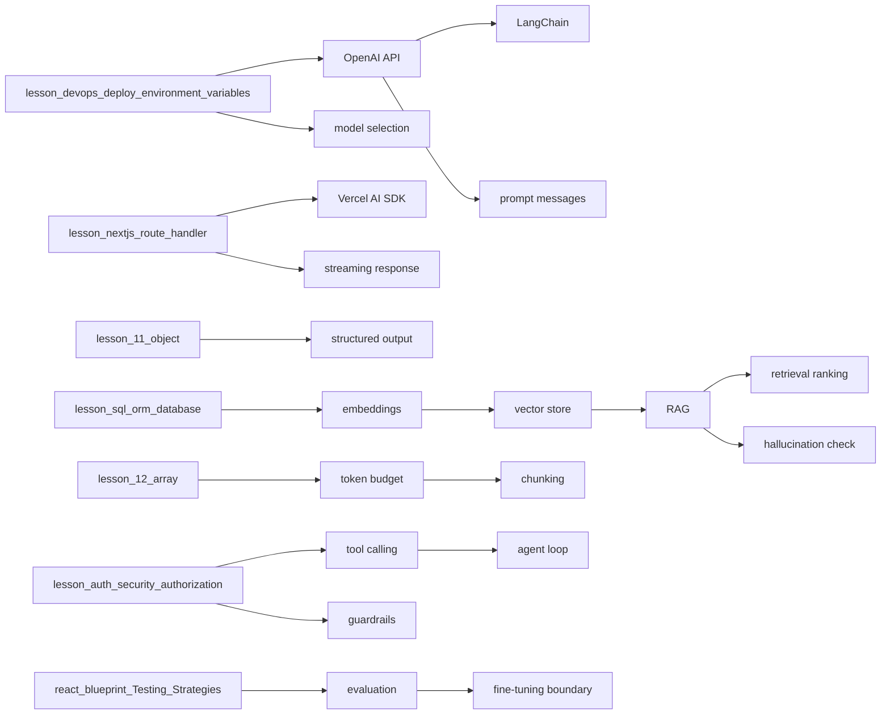
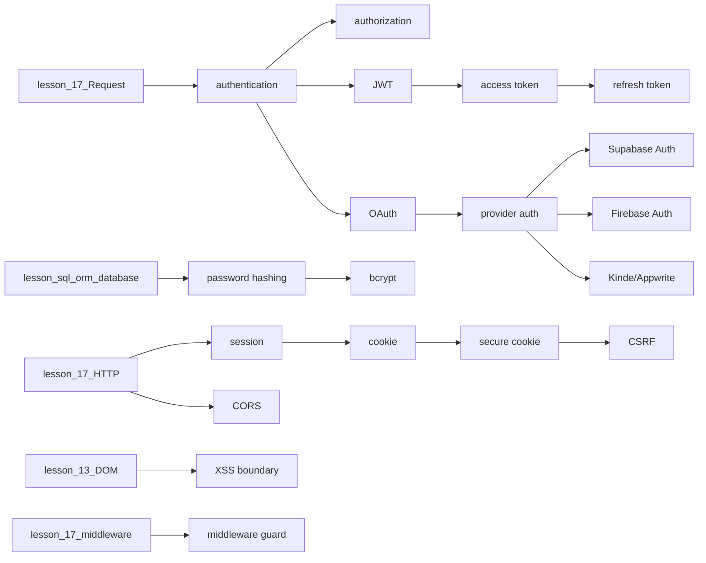
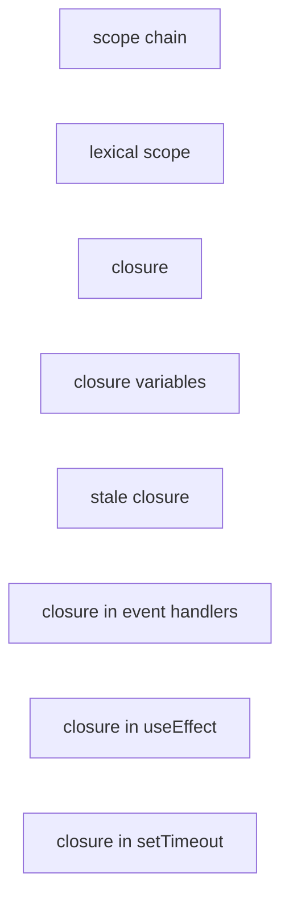
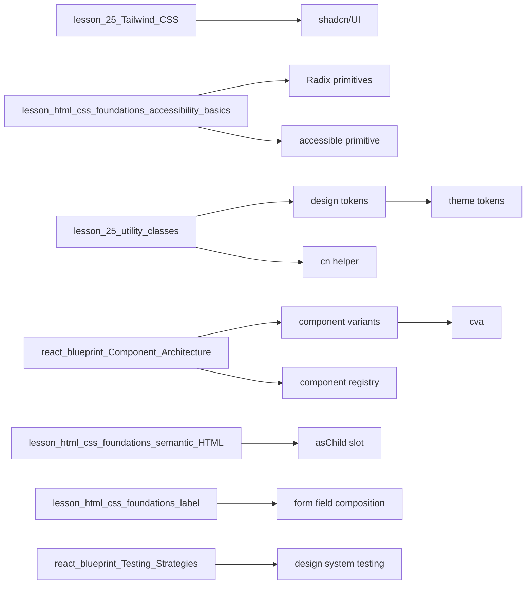
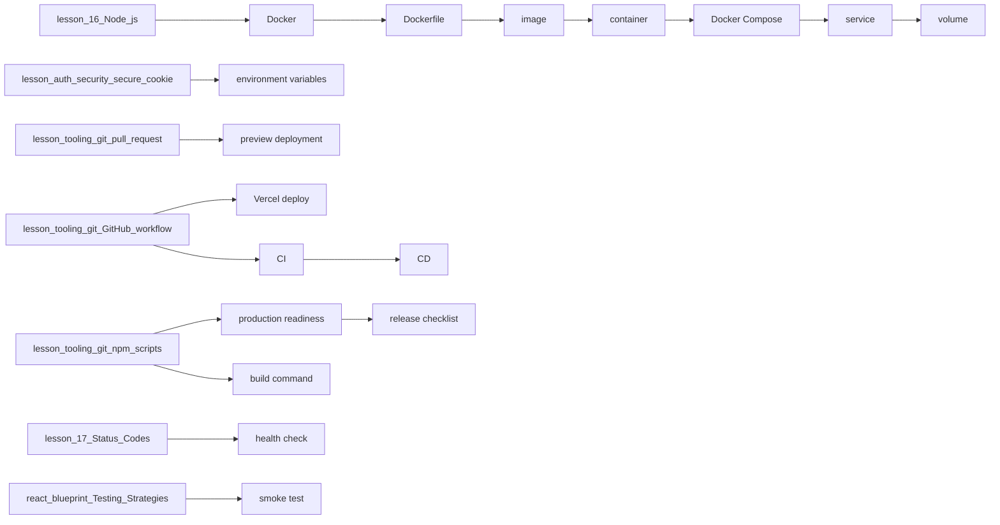
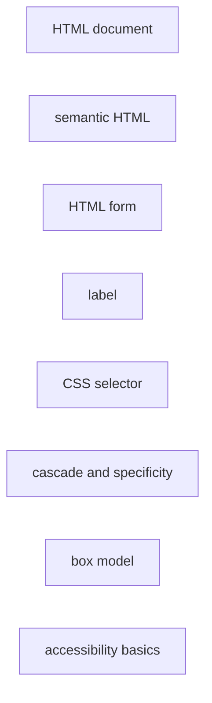
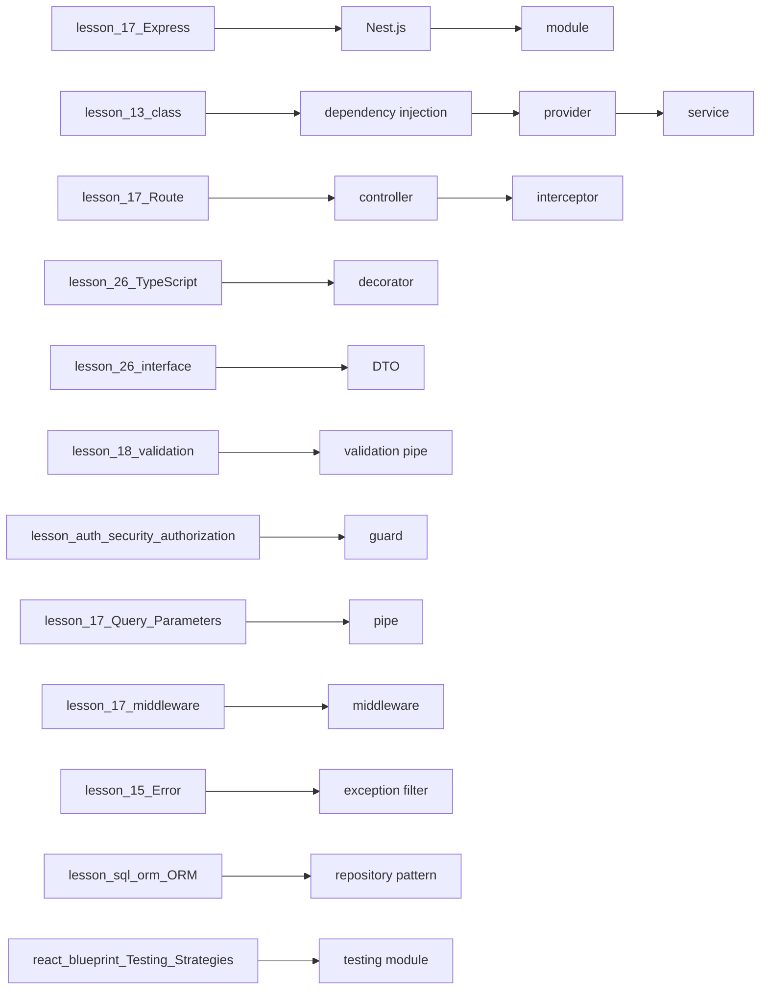
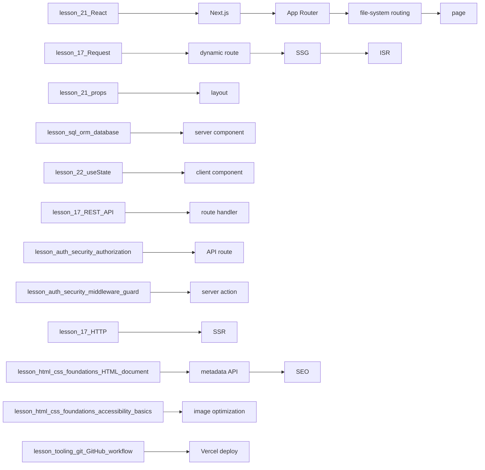
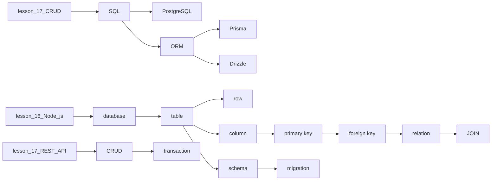
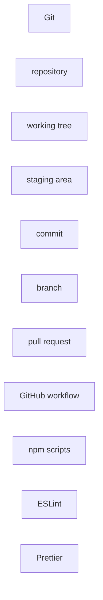

# גרף תלויות בין מושגים

מציג את הסדר הלוגי של למידה — מה צריך ללמוד לפני מה.

## תלויות לפי שיעור

### AI Engineering - OpenAI, Vercel AI SDK, RAG ו-Agents

### Auth & Security - אימות, הרשאות וגבולות אבטחה

### Closures — סגירות (הגורם השכיח לבאגים ב-React)

### Design Systems - Tailwind, shadcn/UI ו-Accessible Primitives

### DevOps Foundations - Vercel, Docker, CI/CD ו-Testing

### HTML/CSS Foundations — יסודות HTML ו-CSS

### Nest.js Bridge - Modules, Controllers, Providers ו-DI

### Next.js Full-Stack - Routing, SSR, API ו-SEO

### SQL/PostgreSQL/ORM - בסיסי נתונים רלציוניים

### Tooling & Git — כלי פיתוח, Git וזרימת עבודה

---

## סדר לימוד מומלץ

Topological order — מושגים שלא תלויים באף אחד מופיעים ראשונים.

**AI Engineering - OpenAI, Vercel AI SDK, RAG ו-Agents** — מושגי בסיס:
- evaluation

**Closures — סגירות (הגורם השכיח לבאגים ב-React)** — מושגי בסיס:
- scope chain
- lexical scope
- closure
- closure variables
- stale closure
- closure in event handlers
- closure in useEffect
- closure in setTimeout

**Design Systems - Tailwind, shadcn/UI ו-Accessible Primitives** — מושגי בסיס:
- component variants
- component registry
- design system testing

**DevOps Foundations - Vercel, Docker, CI/CD ו-Testing** — מושגי בסיס:
- smoke test

**HTML/CSS Foundations — יסודות HTML ו-CSS** — מושגי בסיס:
- HTML document
- semantic HTML
- HTML form
- label
- CSS selector
- cascade and specificity
- box model
- accessibility basics

**Nest.js Bridge - Modules, Controllers, Providers ו-DI** — מושגי בסיס:
- testing module

**Tooling & Git — כלי פיתוח, Git וזרימת עבודה** — מושגי בסיס:
- Git
- repository
- working tree
- staging area
- commit
- branch
- pull request
- GitHub workflow
- npm scripts
- ESLint
- Prettier

---

**סה"כ:** 145 מושגים · 118 תלויות · 10 שיעורים

**עודכן אוטומטית:** 2026-05-02T13:11:27.312Z