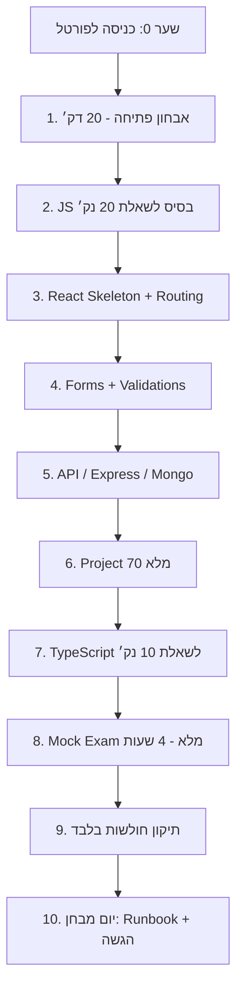

# דוח באגים, ניווט ומפת מסלול - SVCollege Exam Portal

תאריך סריקה: 5 במאי 2026  
מטרה: לבדוק את כל דפי האתר, תפריטי המשתמש, כפתורים, כפילויות, כיסוי חומר, ולבנות תוכנית לשיפור עץ הניווט ומסלול ההכנה למבחן.

## שורה תחתונה

המערכת במצב חזק מאוד מבחינת תוכן ובדיקות: אין פערי חומר מבחן, אין פערי שאלות MC/Fill, הטאבים עוברים smoke, ה־PWA עובר, וה־finish-line עבר 18/18.

הבעיה המרכזית אינה "חסר חומר", אלא חוויית משתמש: תלמיד שנכנס בפעם הראשונה עדיין יכול לראות יותר מדי אפשרויות ויותר ממפת ניווט אחת. בסבבי התיקון שלאחר הדוח עץ הבית הושלם ל־23/23 טאבים ללא כפילויות, התפריט העליון נוקה ל־15 כפתורי מבחן, 8 אזורים ישנים הועברו לעץ מתקדם, ונוספה מפה גרפית עם תחנות ופרסים למסך Exam 100.

עדכון יישום: עץ הפורטל נשען עכשיו על מקור קנוני אחד: `data/site_navigation_tree.js`. גם עמוד הבית וגם מפת האתר באפליקציה נבנים ממנו, ושער `svcollege:navigation-tree:strict` מונע drift.

ציון מערכת כולל כרגע: **96/100 כמערכת הכנה**, אבל רק **86/100 בחוויית התחלה למשתמש חדש**.

## היקף הסריקה

נסרקו:

| אזור | כמות | תוצאה |
|---|---:|---|
| טאבים ראשיים בפורטל | 23 | 23/23 עוברים |
| מדריכי HTML שנוצרו | 11 | 11/11 עם עץ ניווט |
| שיעורים נטענים | 29 | 568 מושגים |
| שיעורי מבחן קריטיים | 11 | 240 מושגי מבחן |
| נכסי PWA/offline | 199 | 199/199 cached |
| בדיקות finish-line | 18 | 18/18 עברו |

מגבלה: סריקת הדפדפן האינטראקטיבית של ה־in-app browser נסגרה בזמן בדיקה ידנית, לכן הדוח נשען על smoke scripts, console gate, visual overlap, accessibility, PWA, בדיקות תוכן, וסריקת HTML/DOM סטטית. זו עדיין סריקה רחבה, אבל לא תחליף לקליק ידני בכל כפתור בדפדפן חי.

## ראיות בדיקה

| בדיקה | תוצאה |
|---|---|
| `report_svcollege_top_tab_browser_smoke.js --strict` | 23/23 טאבים, 0 failures, 0 console errors |
| `report_svcollege_full_portal_smoke.js --strict` | 9/9 checks, desktop/mobile ready |
| `report_svcollege_visual_overlap_audit.js --strict` | ready true, 0 failures |
| `report_svcollege_console_gate.js --strict` | 5/5, no critical console failures |
| `report_lesson_material_gaps.js --strict` | 11 שיעורי מבחן, 240 מושגים, 0 gaps |
| `report_question_coverage_targets.js --strict` | 568 מושגים, 0 MC gaps, 0 Fill gaps |
| `verify_guides.js` | 11/11 דפי מדריכים עם עץ ניווט |
| `report_svcollege_pwa_offline_smoke.js --strict` | 199/199 assets cached |
| `export_svcollege_student_summary.js --strict` | readiness 100, 15/15 modules |
| `report_svcollege_tab_matrix.js --strict` | 100% strict coverage |
| `report_exam_accessibility_audit.js --strict` | 7/7 |
| `report_performance_budget.js --json` | 8/8, אבל קרוב מאוד לתקרה |
| `report_finish_line_prerelease.js --strict` | 18/18, ready true |

## ציונים לפי תחום

| תחום | ציון | אבחון |
|---|---:|---|
| כיסוי חומר למבחן | 100 | 0 פערי חומר מבחן לפי strict gate |
| כיסוי שאלות ותרגול | 100 | 0 פערי MC/Fill לפי coverage target |
| יציבות פונקציונלית | 98 | כל שערי smoke/console/PWA עברו |
| ביצועים וגודל קבצים | 82 | עובר, אבל קרוב מאוד לתקרות התקציב |
| נגישות בסיסית | 95 | audit עבר, עדיין צריך בדיקת מקלדת ידנית מלאה |
| תפריט עליון | 92 | נוקה ל־15 כפתורי מבחן; 8 אזורים ישנים זמינים רק דרך "הצג מתקדם" |
| עץ פורטל בעמוד הבית | 98 | 23/23 טאבים ממופים ממקור קנוני אחד, 0 כפילויות |
| עץ מדריכים | 97 | כל הדפים מכוסים, current page מסומן |
| מצב Homework/Exam 100 | 92 | טוב, אבל צריך להיות ברירת המחדל החזותית היחידה |
| חוויית "אני לא יודע איפה להתחיל" | 86 | השתפרה, אבל עדיין יש יותר מדי משטחי ניווט |
| תחזוקה | 78 | `app.js` ו־CSS גדולים, תקציבי performance צפופים |
| מסלול משחקי עם פרסים | 86 | נוספה מפת תחנות ופרסים ב־Exam 100; צריך לחבר אותה ל־progress UI עמוק יותר |

## ציונים לכל תפריט משתמש

| תפריט/ניווט | ציון | מה טוב | מה בעייתי |
|---|---:|---|---|
| תפריט הטאבים העליון | 92 | 15 כפתורי מבחן נקיים כברירת מחדל | עדיין קיימת שכבת מתקדם למשתמש שרוצה הכול |
| תפריט מפת האתר באפליקציה | 88 | מחולק לקבוצות מבחן | לא מספיק דומיננטי כנקודת כניסה |
| עץ הפורטל בעמוד הבית | 98 | מכוון ל־70/20/10 | כל הטאבים ממופים ממקור קנוני |
| עץ המדריכים | 97 | קיים בכל 11 הדפים, כולל `aria-current` | CSS משוכפל inline, חוב תחזוקה |
| ניווט שיעורים פנימי | 80 | עשיר ומלא | צפוף, דורש Heat/Gate ברור יותר |
| Homework Exam Mode | 92 | הכי קרוב למסלול הכנה אמיתי | צריך להציג "המסלול שלי" כבלוק יחיד ראשון |
| כפתורי quick/floating actions | 76 | שימושיים למשתמש מתקדם | למתחיל הם מוסיפים רעש |

## ממצאי באגים וסיכונים

### P1 - חשוב לתקן לפני שמכריזים על UX מושלם

1. **תוקן בסבב המשך: עץ הבית מייצג את כל הטאבים**
   - מצב קודם: היו חסרים `reward-store`, `anatomy`, `home`.
   - מצב אחרי תיקון: 23/23 טאבים ממופים, 0 broken targets, 0 duplicate targets.
   - מצב אחרי תיקון נוסף: העץ עבר ל־`data/site_navigation_tree.js`, ומפת האתר משתמשת באותו מקור.

2. **תקציבי הביצועים צפופים מדי**
   - `index.html`: 119974 מתוך 120000 בתים.
   - `app.js`: 1749757 מתוך 1750000 בתים.
   - `style.css`: 698288 מתוך 700000 בתים.
   - השפעה: כל תוספת קטנה יכולה לשבור release gate.

3. **בלבול בין `file://` לבין שרת מקומי**
   - המשתמש עדיין פותח את `index.html` כקובץ.
   - ב־`file://` חלק מהיכולות כמו profile/API/service worker לא מתנהגות כמו בשרת.
   - השרת הנכון בהרצה האחרונה עלה על `http://127.0.0.1:5176/` כי 5175 היה תפוס.

### P2 - בעיות UX שמבלבלות תלמיד

4. **תוקן בסבב המשך: כפתורים כפולים בעץ הבית**
   - מצב קודם: `mock-exam`, `codeblocks`, `trace` הופיעו בכפילויות.
   - מצב אחרי תיקון: 23 targets, 23 ייחודיים, 0 missing, 0 duplicate.
   - מצב אחרי תיקון נוסף: גם מפת האתר הפנימית קוראת מאותו מקור קנוני.

5. **יותר מדי מערכות ניווט במקביל**
   - top tabs, site map menu, home portal tree, guide tree, lesson sidebar, floating actions.
   - כל אחת עובדת, אבל יחד הן יוצרות עומס קוגניטיבי.

6. **המסלול הגרפי עדיין לא מרכזי מספיק**
   - תלמיד צריך לראות "שלב 1 מתוך 10" ולא להבין לבד מתוך טאבים.
   - היום יש מסלול, אבל הוא לא מספיק משחקי/חזותי כדי למשוך קדימה.

### P3 - תחזוקה ושיפור

7. **עיצוב מדריכים משוכפל**
   - כל 11 דפי המדריכים כוללים עץ ניווט תקין.
   - אבל חלק מה־CSS/מבנה חוזר בכל קובץ, וזה יוצר חוב תחזוקה.

8. **אזורים לא רלוונטיים למבחן צריכים בידול חד יותר**
   - AI/DevOps/Nest/אזורים מתקדמים צריכים להיות אדומים או תחת "לא השבוע".
   - כרגע הם קיימים במערכת, אבל לא תמיד ברור למתחיל שלא מתחילים מהם.

## כפתורים וניווט - מצב נוכחי

| בדיקה | מצב |
|---|---|
| כפתורים שמפנים לטאב לא קיים | 0 |
| targets כפולים בעץ הבית | 0 |
| טאבים ראשיים שלא בעץ הבית | 0 |
| מדריכים בלי עץ ניווט | 0 |
| מדריכים בלי כפתור הדפסה | 0 |
| מדריכים בלי חזרה להתחלה | 0 |

## Master Plan לשיפור תפריט המשתמש

### שלב 1 - עץ ניווט קנוני אחד

זמן: 1.5 שעות  
מטרה: כל טאבי המערכת יופיעו בעץ אחד, או יסומנו במפורש כ"לא במסלול השבוע".

משימות:
- להוסיף לעץ הבית את `reward-store`, `anatomy`, `home`.
- להוסיף label לכפילויות: "מופיע גם במסלול JS" / "מופיע גם בפרויקט".
- להוסיף בדיקה: כל טאב חייב להיות בעץ או להיות מסומן hidden/advanced.

קריטריון מעבר:
- 23/23 טאבים ממופים בעץ אחד. בוצע בעץ הבית.
- 0 כפילויות ללא סיבה. בוצע בעץ הבית.

### שלב 2 - מקור נתונים יחיד לניווט

זמן: 2 שעות  
מטרה: top tabs, site map, home tree ו־Exam 100 יקראו מאותו `SITE_TREE`.

משימות:
- ליצור אובייקט ניווט קנוני.
- לסמן לכל node: `examRelevance`, `heat`, `route`, `parent`, `duplicateReason`.
- לרנדר ממנו את עץ הבית ואת מפת האתר.

קריטריון מעבר:
- שינוי שם/טאב במקום אחד מעדכן את כל התפריטים.

### שלב 3 - מסך מסלול גרפי עם פרסים

זמן: 2 שעות  
מטרה: להפוך את ההתקדמות למסלול משחקי ברור.

משימות:
- ליצור בלוק "המסלול שלי לציון 100".
- להציג 10 תחנות, כל תחנה עם Gate ופרס.
- להציג current step, next step, final goal.

קריטריון מעבר:
- תלמיד רואה תוך 10 שניות איפה הוא מתחיל, איפה הוא עכשיו, ואיפה הסיום.

### שלב 4 - חוויית כניסה נקייה

זמן: 2 שעות  
מטרה: מסך ראשון עם החלטה אחת בלבד.

משימות:
- CTA יחיד: "המשך במסלול שלי" או "התחל אבחון".
- כל הטאבים המתקדמים תחת "ספרייה מתקדמת - לא השבוע".
- להציג Heat 1-10 רק אחרי שהמשתמש פותח פירוט.

קריטריון מעבר:
- אין יותר מ־CTA מרכזי אחד במסך הראשון.

### שלב 5 - בדיקות נגד רגרסיה

זמן: 1.5 שעות  
מטרה: שלא נחזור לעץ חסר/כפול.

משימות:
- test שכל top tab מופיע בעץ או מסומן advanced.
- test שאין duplicate target בלי `duplicateReason`.
- test שהמסלול הגרפי נטען בדסקטופ ובמובייל.
- performance budget עם מרווח של לפחות 2KB.

קריטריון מעבר:
- כל השערים ירוקים ותקציב הקבצים לא על הקצה.

## מפת מסלול מלאה מהתחלה עד מבחן



## מסלול גרפי עם פרסים

| שלב | זמן | Gate מעבר | פרס שמוצג |
|---|---:|---|---|
| 0. כניסה | 5 דק׳ | המשתמש בוחר/מקבל מסלול | מצפן התחלה |
| 1. אבחון | 20 דק׳ | ציון אבחון ורמה | Badge "מצאתי את הרמה שלי" |
| 2. JS 20 | 2:30 שעות | פתרון 3 שאלות JS ב־20 דק׳ כל אחת | מטבע אלגוריתמים |
| 3. React Skeleton | 3:00 שעות | routes מלאים תוך 30 דק׳ | מפתח Routes |
| 4. Forms/Validations | 4:00 שעות | אין submit עם input לא תקין | מגן ולידציות |
| 5. API/Mongo | 3:30 שעות | CRUD עובד מול server | ליבת שרת |
| 6. Project 70 | 5:00 שעות | ציון עצמי 55/70 ומעלה | מדליית Builder |
| 7. TS 10 | 1:30 שעות | שאלה TS ב־10 דק׳ | תג Type Master |
| 8. Mock Exam | 4:00 שעות | ציון 80+ | שעון מבחן |
| 9. תיקון חולשות | 3:00 שעות | רשימת חולשות ריקה/מטופלת | חץ מטרה |
| 10. יום מבחן | 30 דק׳ הכנה | checklist הגשה מלא | כתר Exam 100 |

## עץ אתר מומלץ

```text
SVCollege Exam Portal
├── התחלה
│   ├── התחל כאן
│   ├── אבחון פתיחה
│   ├── המסלול שלי
│   └── סטטוס התקדמות
├── פרויקט 70 נק׳
│   ├── React Skeleton
│   ├── Routing
│   ├── Forms + Validations
│   ├── API / CRUD
│   ├── Project Mock
│   └── Checklist הגשה
├── JavaScript 20 נק׳
│   ├── מערכים ואובייקטים
│   ├── קלט ו־throw new Error
│   ├── תרגילי זמן
│   └── בנק שאלות
├── TypeScript 10 נק׳
│   ├── type / interface
│   ├── enum / union
│   ├── narrowing
│   └── שאלת 10 דקות
├── Backend
│   ├── Express
│   ├── Mongo / Mongoose
│   └── API integration
├── מדריכים
│   ├── רעיון מאחורי כל דבר
│   ├── פתרון שיעורי בית ומבחנים
│   ├── מה עושים בזמן מבחן
│   ├── דף חירום
│   └── מעקב 94:45
└── ספרייה מתקדמת - לא השבוע
    ├── AI
    ├── DevOps
    ├── Nest
    ├── Reward Store
    ├── Anatomy
    └── טאבים לא קריטיים למבחן
```

## Definition of Done לתפריט מושלם

- משתמש חדש רואה פעולה אחת: "התחל אבחון" או "המשך במסלול".
- יש עץ ניווט אחד שמכיל 23/23 טאבים או מסמן אותם כמתקדמים.
- אין כפתור כפול בלי הסבר.
- כל שלב במסלול מציג: זמן, Gate, תרגיל, פרס, והשלב הבא.
- כל אזור לא רלוונטי למבחן מסומן אדום או מקופל.
- אין בלבול `file://`; מוצגת כתובת שרת מקומי ברורה.
- performance budget נשאר ירוק עם מרווח אמיתי, לא 26 בתים.
- כל שערי release עוברים.

## המלצה מיידית לתלמיד

אל תתחיל מהטאבים. התחל מ־Homework Exam Mode / Exam 100 Path:

1. אבחון פתיחה.
2. מסלול שהמערכת ממליצה עליו.
3. Project 70.
4. JS 20.
5. TS 10.
6. Mock Exam מלא.
7. תיקון חולשות בלבד.

כתובת שרת מומלצת בהרצה האחרונה: `http://127.0.0.1:5176/`  
לא ללמוד דרך `file://` אם רוצים profile, שמירה, PWA והתנהגות מלאה.
